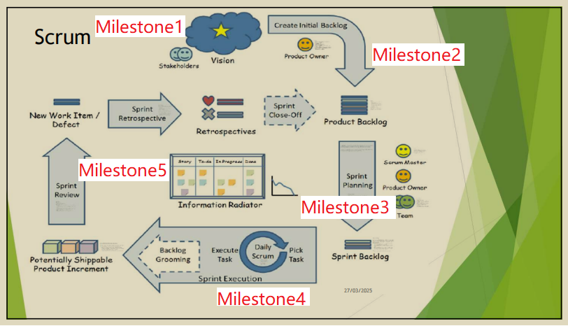
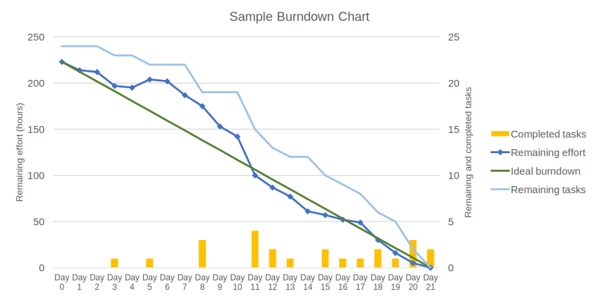

# My Scrum's Notes

[目录]

- [My Scrum's Notes](#my-scrums-notes)
  - [基础概念](#基础概念)
    - [Scrum 是什么](#scrum-是什么)
    - [何为 Sprint](#何为-sprint)
  - [Scrum 流程](#scrum-流程)
  - [三个角色](#三个角色)
  - [四个工件](#四个工件)
    - [Product Backlog](#product-backlog)
    - [Sprint Backlog](#sprint-backlog)
    - [Sprint Burndown 燃尽图](#sprint-burndown-燃尽图)
    - [Product Burndown 燃尽图](#product-burndown-燃尽图)
  - [四五个会议](#四五个会议)
  - [Scrum Methodology 方法论](#scrum-methodology-方法论)

## 基础概念

### Scrum 是什么  

- 一种项目管理方法, 不只用在软件开发行业.
- 一种Agile方法论的实现框架. 其他对等的实践还有"eXtreme Programming", Pair programming, acceptance testing等等.
- 是1993年由 Ken Schwaber & Dr Jeff Sutherland 所提出的.
- 大方向是: 少文档, 少Bulls*t，少浪费时间做无谓的事, 多看黑板, 有错就改.
- 主要有三个角色: `Product Owner` / `Dev Team` / `Scrum Master`. 详见[三个角色](#三个角色).
- 有四个主要工件: `Product Backlog` / `Sprint Backlog` / `Product Burndown` / `Sprint Burndown`. 详见[四个工件](#四个工件).
- 引入了'Done'的概念, 又称为'Acceptance Criteria'  

`Scrum` 这个词指橄榄球运动中一次抢球. 取其含义是，在激烈的混乱中仍然控制着你的项目.  

### 何为 Sprint

把工作拆成2-4周（一般不超过4周）的工作量, 这样一个开发迭代称为一个"Sprint"， 在每个Sprint里, 开发团队DT完成一定的产品增量, 产生一个可交付的产品.

## Scrum 流程

5个 Milestone说明:

    1. 所有利益相关人共同提出并认可一个Product Vision(PV 产品愿景), 由Product Owner(PO 产品负责人,)负责.

    2. PO负责把Product Vision细化成User Story, 维护优先级, 定义"Acceptance Criteria", 并存储在Product Backlog.   
    
    在每个Sprint Planning 会议之前, 强烈建议PO和DT进行一次 Backlog Booming 会议.

    3. 全Team召开 Sprint Planning 会议, 共同决定本次Sprint需要完成的 Tasks, 写进Sprint Backlog.

    4. Dev Team 进入开发流程, 期间每日召开 Daily Scrum 会议, 汇报昨日完成的以及明天前需要完成的Task. 即时更新Sprint Burndown图.

    5. 在本次开发的最后环节,召开Sprint Review会议, 由DT展示完成的Task, 由PO决定 Accept 或者 Reject 本次 Product Increment(产品增量), 同时也可能会产生新的对产品的意见, PO写进Product Backlog, 更新 Product Burndown.  
      
    在本次Sprint结束前, 还要召开 Sprint Retrospective, 检讨本次Sprint的过程, 提出改进意见.

   Scrum鼓励团队成员共处一室, 开放沟通, 少打电话少通Email, 多讨论.

   Scrum工件实体全展示在大家面前, 随时看着. 包括Story board, backlog, burndown chart, architecture maps, designs 等等.

## 三个角色

   1. **Product Owner (PO)**  

      PO 是独立的单人, 对项目的成功负责, 也就是说他的工作涵盖了向团队推广Product Vision, 和团队协商Sprint目标等等. PO需要不断的调整Product Backlog的优先级, 以反应这些任务的商业价值.  
  
      PO要写"以用户为中心"的 `User Story`, 即只用一两句用商业角度来描绘产品功能, 然后交给DT去实现.

      由于PO要负责为公司产生投资回报, 所以PO这个角色在 Sprint Review的会议中执掌着接受或否决产品增量的生杀大权.  

   2. **Development Team (DT)**  

      DT 是一个跨功能和自理的团队, 可以把PO和SM都包括在内, 人数约为5~9人. 主要负责每个Sprint的产品增量开发. 鼓励现场办公, 口头沟通.  
      每次Sprint Planning会议上, DT 和 PO商议本次Sprint的工作Task.
   3. **Scrum Master (SM)**  

      SM为团队建立生产力和自理能力, 去除流程上的障碍, 让团队遵守Scrum规则, 以及保证所有工件的展示.  

        注意: SM是没有实权的. 这个角色的功能就是一个"仆从头目", 建议由那些会为项目成功而感到满足, 而非个人英雄主义者的人来担任这个角色. SM不是团队领袖, 更应该是团队和干扰因素之间的防撞栏.

## 四个工件

### Product Backlog

- 一套将会进入Sprint的功能集,
- Backlog是按优先级排序的, 能反映其商业价值的,
- 一套高层次的待办事项的客户需求. (高层次是指有宽度的描述)
- 附带着效用的预估.

说人话，Product Backlog就是（客户需要的）产品功能清单，并附带验收标准（Acceptance Criteria）。

### Sprint Backlog

- 在Sprint Planning会议中,由PO提出和DT承诺后决定,
- 从Product Backlog中提取的子集.
- 在Sprint期间不能被更改,
- 但DT如果认为不能完成本次Sprint,可以取消这个Sprint而重开一个Sprint Planning会议.

说人话，Sprint Backlog就是功能清单的一部分，拆分成若干具体任务，然后干它！

### Sprint Burndown 燃尽图

- Sprint燃尽图是一块公告板,显示着当前Sprint还有多少剩余工作.
- 需要每日更新, 令进度可视化.
  
    示例:

### Product Burndown 燃尽图

同上, 略

## 四五个会议

1. **Sprint Planning**  
    PO + DT 约半天-整天, 商议接下来的Sprint里, DT要尝试完成哪些工作.  
    PO 负责: 指出最优先的Task.  
    DT 负责: 承诺在Sprint时间内可完成的工作量.  

2. **Daily Standup**  
    DT 每日15分钟, 同时同地, 相互交换信息. 每位成员汇报自上次会议以来完成的工作, 至下次会议之前将要完成的工作, 以及过程中遇到的困难.
3. **Sprint Review**  
    PO + DT 约4小时, 产品增量的验收.  
    DT 负责: 产品增量的功能演示.  
    PO 负责: 接受或否决本次产品增量. 是一个检查产品进度和调整产品发展方向的机会.  
4. **Sprint Retrospective**  
    约3小时, 为团队提供一个以检视自己流程的机会. 团队自己反映自己在本Sprint中的表现, 提出改进建议.
5. **Backlog grooming**  
    建议使用Sprint时长的5%, (约一日/一月), 这个会议常被认为是Scrum的第五个会议. 本会议为PO和DT创造会面时间,在Sprint Planning会议前共同预习backlog.  

## Scrum Methodology 方法论

> *"历史会不断重复, 除非你做出一点改变"。*

Scrum框架的是基于“Empirical Process Control 依靠经验主义的过程控制”理论。

这是一种基于实际观察和实时反馈来管理流程的方法，而非依赖预先定义的理论或固定计划。其核心思想是通过持续收集数据、验证假设并灵活调整，以应对复杂或不可预测的环境。主要原理有：

- 透明度 Transparency：所有流程和数据对团队可见。
- 检查 Inspection：定期检查进展和问题。
- 调整 Adaptation：根据反馈快速调整。

`透明度` 能建立团队之间的 `信任`。当团队认同了透明度，他们就会贯彻`检查`和`调整`过程。

由于文化差异，这点我是比较难理解的，为什么透明度能带来团队间的“信任”。透明度对我来说也是最难的，人都要面子，都认为自己的问题只有自己能解决。

Deepseek给出的答案是：通过消除信息不对称、减少不确定性和促进共同责任，创造了合作的基础。当信息不透明时，团队成员容易因“未知”而产生猜测（例如：“其他组在做什么？为什么决策变了？”），导致误解或戒备。

透明度本质是通过降低合作的心理风险来建立信任。当人们确信环境是开放、公平、可验证时，会更愿意投入协作，而非花费精力在防备或政治博弈上。
